# LUMIQ - Software Architecture Documentation

This document provides detailed software architecture diagrams and explanations for the LUMIQ platform, covering all layers from presentation to data persistence.

---

## Table of Contents

1. [System Architecture Overview](#system-architecture-overview)
2. [Layered Architecture](#layered-architecture)
3. [Component Architecture](#component-architecture)
4. [Data Architecture](#data-architecture)
5. [Security Architecture](#security-architecture)
6. [Deployment Architecture](#deployment-architecture)
7. [Integration Architecture](#integration-architecture)

---

## System Architecture Overview

### High-Level System Architecture

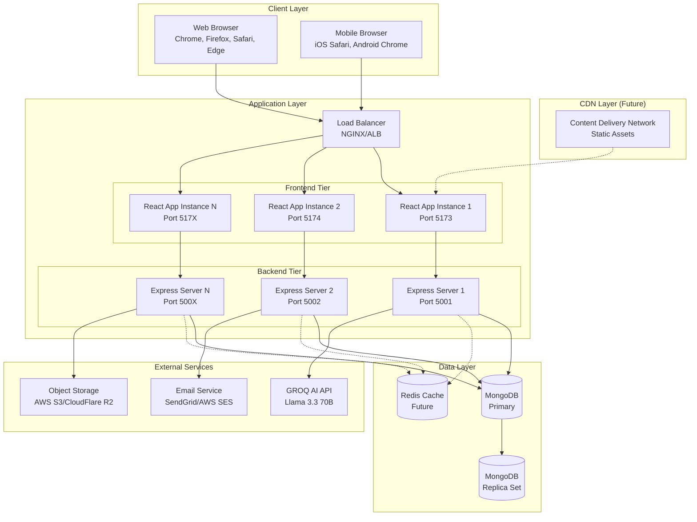

---

## Layered Architecture

### 1. Seven-Layer Architecture Diagram

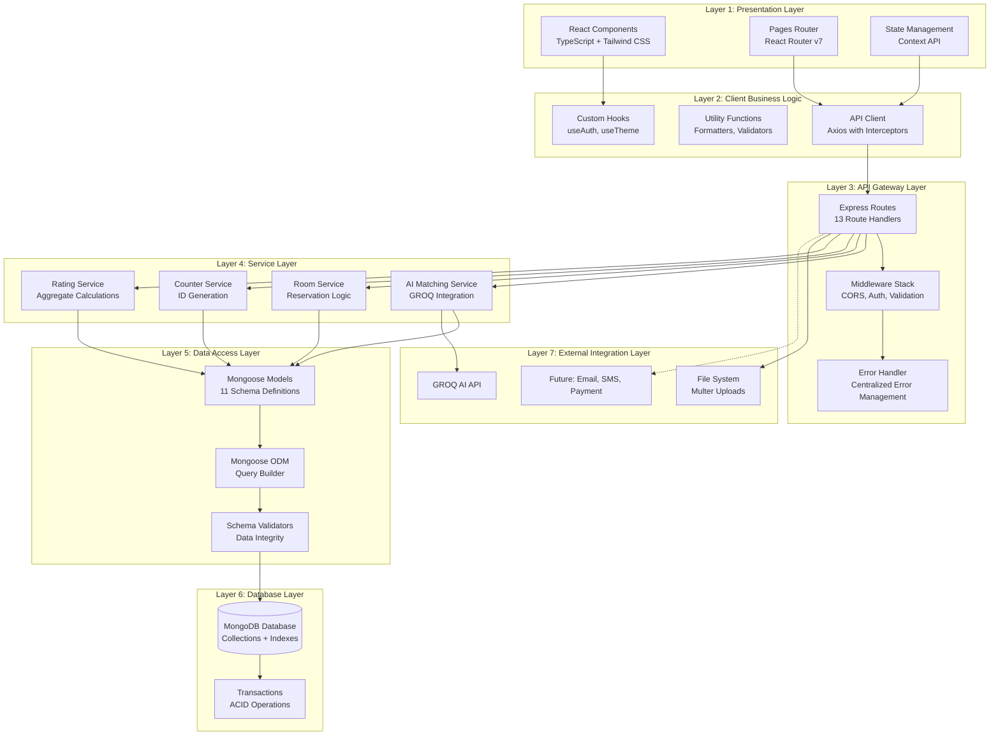

### 2. Request Processing Flow

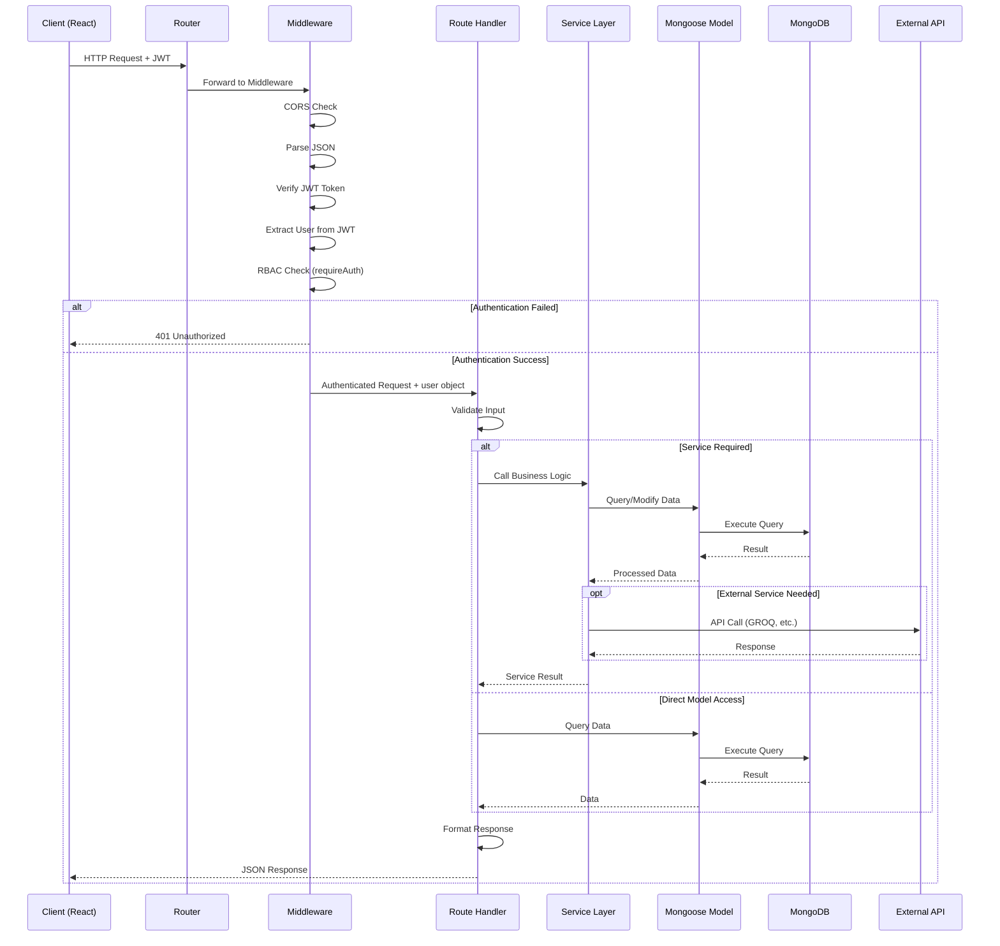

---

## Component Architecture

### 1. Frontend Component Hierarchy

```mermaid
graph TB
    subgraph "Root Component"
        App[App.tsx<br/>Router Provider + Auth Context]
    end
    
    subgraph "Layout Components"
        RootLayout[Root Layout<br/>Navbar + Footer]
        AuthLayout[Auth Layout<br/>Login/Signup wrapper]
        AdminLayout[Admin Layout<br/>Sidebar + Header]
    end
    
    subgraph "Page Components"
        subgraph "Student Pages"
            Home[Home Page]
            AllDorms[All Dorms Page]
            DormDetail[Dorm Detail Page]
            RoomBooking[Room Booking Page]
            Roommates[Roommates Page]
            KnockKnock[Knock-Knock Page]
            Connection[Connection Page]
            MyAccount[My Account Page]
        end
        
        subgraph "Admin Pages"
            Overview[Overview Dashboard]
            MyDorms[My Dorms Management]
            Rooms[Rooms Management]
            Bookings[Bookings Management]
            Analytics[Analytics Dashboard]
            Settings[Admin Settings]
        end
        
        subgraph "Auth Pages"
            Login[Login Page]
            Signup[Signup Page]
        end
    end
    
    subgraph "Shared Components"
        Navbar[Navbar<br/>Theme Toggle + Notifications]
        Footer[Footer<br/>Links + Info]
        Notifications[Notifications Panel<br/>Dropdown List]
        FloatingChat[Floating Chat Widget<br/>Minimizable]
        Loader[Loader Component<br/>Spinning Animation]
        Logo[Logo Component<br/>SVG Icon]
    end
    
    subgraph "UI Components (shadcn/ui)"
        Card[Card Components]
        Button[Button Variants]
        Input[Input Fields]
        Badge[Status Badges]
        Dialog[Modal Dialogs]
        Dropdown[Dropdown Menus]
    end
    
    subgraph "Context Providers"
        AuthContext[Auth Context<br/>User + Token State]
        ThemeContext[Theme Context<br/>Light/Dark Mode]
    end
    
    App --> AuthContext
    App --> ThemeContext
    App --> RootLayout
    App --> AuthLayout
    App --> AdminLayout
    
    RootLayout --> Navbar
    RootLayout --> Home
    RootLayout --> AllDorms
    RootLayout --> Footer
    
    AdminLayout --> Overview
    AdminLayout --> MyDorms
    
    Navbar --> Notifications
    
    Connection --> FloatingChat
    
    AllDorms --> Card
    AllDorms --> Button
```

### 2. Backend Component Architecture

```mermaid
graph TB
    subgraph "Entry Point"
        Index[index.js<br/>Server Bootstrap]
    end
    
    subgraph "Core Express App"
        ExpressApp[Express Application<br/>Middleware Configuration]
    end
    
    subgraph "Middleware Layer"
        CORS[CORS Middleware<br/>Origin Whitelist]
        Morgan[Morgan Logger<br/>HTTP Request Logging]
        BodyParser[JSON Parser<br/>Request Body Parsing]
        AuthMW[Auth Middleware<br/>JWT Verification]
        RBAC[RBAC Middleware<br/>Role Checking]
    end
    
    subgraph "Route Controllers (13)"
        AuthRoute[auth.js<br/>Signup/Signin]
        UsersRoute[users.js<br/>Profile Management]
        DormsRoute[dorms.js<br/>Dorm CRUD + Shared Suggestions]
        RoomsRoute[rooms.js<br/>Room CRUD + Reservation]
        BookingsRoute[bookings.js<br/>Booking CRUD with RBAC]
        PersonalityRoute[personalities.js<br/>Profile CRUD]
        MatchingRoute[matching.js<br/>Find Matches + AI Analysis]
        KnocksRoute[knocks.js<br/>Send/Accept/Reject]
        NotifRoute[notifications.js<br/>CRUD + Read Status]
        WishlistRoute[wishlist.js<br/>Favorites]
        AnalyticsRoute[analytics.js<br/>Dashboard Stats]
        PreferredRoute[preferred_roommate.js<br/>Preferences]
        ConvoRoute[conversations.js<br/>Chat Conversations]
        MsgRoute[messages.js<br/>Chat Messages]
        ChatSessionRoute[chat-sessions.js<br/>Active Session Tracking]
        HealthRoute[health.js<br/>Health Check]
    end
    
    subgraph "Service Layer (4)"
        AIMatchSvc[aiMatchingService.js<br/>GROQ API Integration]
        RoomSvc[roomService.js<br/>Reservation Logic]
        CounterSvc[counterService.js<br/>Auto-increment IDs]
        RatingSvc[ratingService.js<br/>Rating Calculations]
    end
    
    subgraph "Data Models (11)"
        UserModel[User.js]
        DormModel[Dorm.js]
        RoomModel[Room.js]
        BookingModel[Booking.js]
        PersonalityModel[Personality.js]
        KnockModel[Knock.js]
        NotifModel[Notification.js]
        WishlistModel[Wishlist.js]
        AIMatchModel[AiMatchResult.js]
        PreferredModel[Preferred_roommate.js]
        CounterModel[Counter.js]
        ConvoModel[Conversation.js]
        MsgModel[Message.js]
        RatingModel[Rating.js]
        ChatSessionModel[ChatSession.js]
    end
    
    Index --> ExpressApp
    ExpressApp --> CORS
    ExpressApp --> Morgan
    ExpressApp --> BodyParser
    
    ExpressApp --> AuthRoute
    ExpressApp --> DormsRoute
    
    DormsRoute --> AuthMW
    AuthMW --> RBAC
    
    DormsRoute --> DormModel
    DormsRoute --> RoomSvc
    DormsRoute --> RatingSvc
    
    MatchingRoute --> AIMatchSvc
    AIMatchSvc --> AIMatchModel
    
    RoomsRoute --> RoomSvc
    RoomSvc --> RoomModel
    
    BookingsRoute --> BookingModel
    BookingsRoute --> RoomSvc
```

---

## Data Architecture

### 1. Database Schema Architecture

```mermaid
erDiagram
    USERS ||--o{ PERSONALITIES : "has"
    USERS ||--o{ BOOKINGS : "makes"
    USERS ||--o{ DORMS : "manages (admin)"
    USERS ||--o{ KNOCKS : "sends"
    USERS ||--o{ KNOCKS : "receives"
    USERS ||--o{ NOTIFICATIONS : "receives"
    USERS ||--o{ WISHLISTS : "creates"
    USERS ||--o{ MESSAGES : "sends"
    USERS ||--o{ PREFERRED_ROOMMATE : "has preferences"
    USERS ||--o{ RATINGS : "creates"
    USERS ||--o{ CONVERSATIONS : "participates"
    
    DORMS ||--o{ ROOMS : "contains"
    DORMS ||--o{ BOOKINGS : "receives"
    DORMS ||--o{ RATINGS : "receives"
    
    ROOMS ||--o{ BOOKINGS : "has"
    
    PERSONALITIES ||--o{ AI_MATCH_RESULTS : "analyzed"
    
    CONVERSATIONS ||--o{ MESSAGES : "contains"
    CONVERSATIONS ||--o{ CHAT_SESSIONS : "has active sessions"
    
    USERS {
        int _id PK
        string email UNIQUE
        string password
        string name
        string role
        int dormId FK
        string phone
        date dateOfBirth
        string bio
        date createdAt
    }
    
    DORMS {
        int _id PK
        string name
        string location
        object address
        float latitude
        float longitude
        int price
        array facilities
        array images
        int admin_id FK
        float Water_fee
        string waterBillingType
        float Electricity_fee
        string electricityBillingType
        float insurance_policy
        boolean isActive
        object contactInfo
        object operatingHours
    }
    
    ROOMS {
        string _id PK
        int dormId FK
        string room_number
        int floor
        string room_type
        int capacity
        float price_per_month
        string status
        array amenities
        int currentOccupantId FK
        date moveInDate
        date moveOutDate
        string zone
        string bedType
        float size
    }
    
    BOOKINGS {
        int _id PK
        int userId FK
        int dormId FK
        string roomId FK
        date moveInDate
        int stayDuration
        string durationType
        string paymentMethod
        string paymentSlipUrl
        float bookingFeePaid
        float totalAmount
        string status
        date createdAt
    }
    
    PERSONALITIES {
        int _id PK
        int userId FK
        string nickname
        int age
        string gender
        string nationality
        string sleep_type
        array lifestyle
        string study_habits
        string cleanliness
        string social
        string MBTI
        string going_out
        boolean smoking
        string drinking
        string pets
        string noise_tolerance
        string temperature
    }
    
    KNOCKS {
        int _id PK
        int senderId FK
        int recipientId FK
        string status
        date createdAt
    }
    
    NOTIFICATIONS {
        int _id PK
        int recipientId FK
        string type
        string title
        string message
        boolean read
        object data
        date createdAt
    }
    
    WISHLISTS {
        int _id PK
        int userId FK
        int dormId FK
        date createdAt
    }
    
    AI_MATCH_RESULTS {
        int _id PK
        int userId1 FK
        int userId2 FK
        object analysis
        date analyzedAt
        date expiresAt
    }
    
    PREFERRED_ROOMMATE {
        int _id PK
        int userId FK
        object preferred_price_range
        string preferred_location
        array preferred_amenities
        date createdAt
    }
    
    CONVERSATIONS {
        int _id PK
        array participants
        string lastMessage
        date lastMessageAt
    }
    
    MESSAGES {
        int _id PK
        int conversationId FK
        object sender
        string text
        array readBy
        date createdAt
    }
    
    RATINGS {
        int _id PK
        int userId FK
        int dormId FK
        float rating
        string comment
        date createdAt
    }
    
    CHAT_SESSIONS {
        int _id PK
        int userId FK
        int conversationId FK
        date createdAt
    }
```

### 2. Data Flow Architecture

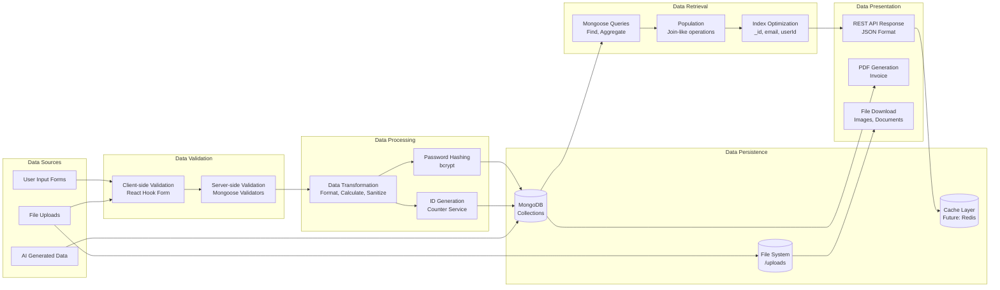

---

## Security Architecture

### 1. Security Layers

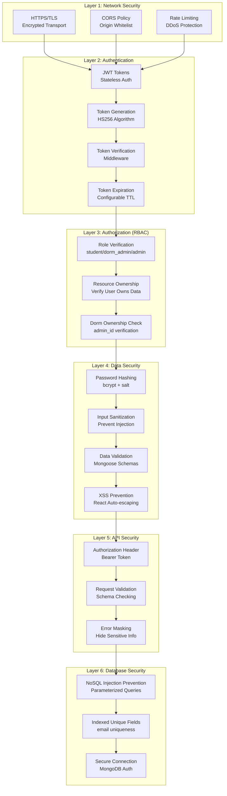

### 2. Authentication & Authorization Flow

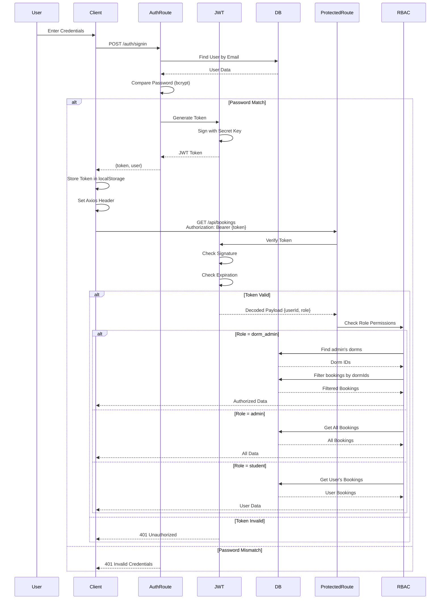

---

## Deployment Architecture

### 1. Development Environment

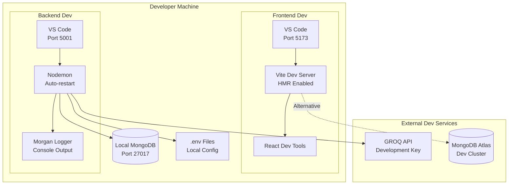

### 2. Production Deployment Architecture

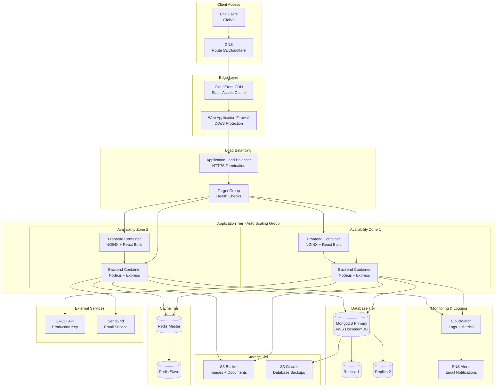

### 3. CI/CD Pipeline

```mermaid
graph LR
    subgraph "Development"
        Dev[Developer<br/>Local Machine]
        Git[Git Commit]
        GitHub[GitHub Repository<br/>Main Branch]
    end
    
    subgraph "CI Pipeline - GitHub Actions"
        Trigger[Workflow Trigger<br/>on push]
        Checkout[Checkout Code]
        
        subgraph "Frontend Pipeline"
            FEInstall[npm install frontend]
            FELint[ESLint Check]
            FEBuild[Vite Build]
            FETest[Unit Tests]
        end
        
        subgraph "Backend Pipeline"
            BEInstall[npm install backend]
            BELint[ESLint Check]
            BETest[Unit Tests]
        end
    end
    
    subgraph "CD Pipeline"
        BuildImage[Build Docker Images]
        PushECR[Push to ECR<br/>Container Registry]
        UpdateECS[Update ECS Service<br/>Rolling Deployment]
    end
    
    subgraph "Deployment"
        ECS[AWS ECS/Fargate<br/>Container Orchestration]
        Health[Health Check]
        Rollback{Deployment<br/>Success?}
    end
    
    subgraph "Notification"
        Slack[Slack Notification<br/>Deployment Status]
        Email[Email Alert<br/>If Failed]
    end
    
    Dev --> Git
    Git --> GitHub
    GitHub --> Trigger
    Trigger --> Checkout
    
    Checkout --> FEInstall
    Checkout --> BEInstall
    
    FEInstall --> FELint --> FEBuild --> FETest
    BEInstall --> BELint --> BETest
    
    FETest --> BuildImage
    BETest --> BuildImage
    
    BuildImage --> PushECR
    PushECR --> UpdateECS
    UpdateECS --> ECS
    ECS --> Health
    Health --> Rollback
    
    Rollback -->|Success| Slack
    Rollback -->|Failure| Email
    Email --> Rollback
```

---

## Integration Architecture

### 1. External Service Integration

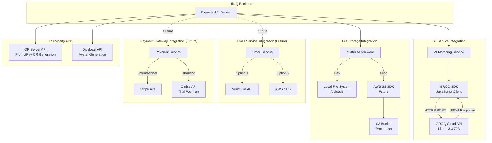

### 2. API Integration Patterns

```mermaid
graph TB
    subgraph "Synchronous Integration"
        SyncRequest[Client Request]
        SyncAPI[API Call to External Service]
        SyncWait[Wait for Response]
        SyncReturn[Return to Client]
        
        SyncRequest --> SyncAPI
        SyncAPI --> SyncWait
        SyncWait --> SyncReturn
    end
    
    subgraph "Asynchronous Integration (Future)"
        AsyncRequest[Client Request]
        QueueJob[Queue Background Job]
        ReturnImmediate[Return Job ID]
        Worker[Worker Process Job]
        Callback[Webhook/Polling]
        
        AsyncRequest --> QueueJob
        QueueJob --> ReturnImmediate
        QueueJob --> Worker
        Worker --> Callback
    end
    
    subgraph "Caching Strategy"
        CacheRequest[API Request]
        CheckCache{Cache<br/>Available?}
        ReturnCache[Return Cached Data]
        FetchAPI[Fetch from API]
        UpdateCache[Update Cache]
        ReturnFresh[Return Fresh Data]
        
        CacheRequest --> CheckCache
        CheckCache -->|Hit| ReturnCache
        CheckCache -->|Miss| FetchAPI
        FetchAPI --> UpdateCache
        UpdateCache --> ReturnFresh
    end
    
    subgraph "Error Handling"
        APICall[API Call]
        TryCatch{Try/Catch}
        Success[Success Response]
        Error[Error Occurred]
        Retry{Retry<br/>Logic}
        Fallback[Fallback Response]
        LogError[Log Error]
        
        APICall --> TryCatch
        TryCatch -->|Success| Success
        TryCatch -->|Error| Error
        Error --> Retry
        Retry -->|Yes| APICall
        Retry -->|No| Fallback
        Fallback --> LogError
    end
```

---

## Performance Architecture

### 1. Performance Optimization Strategy

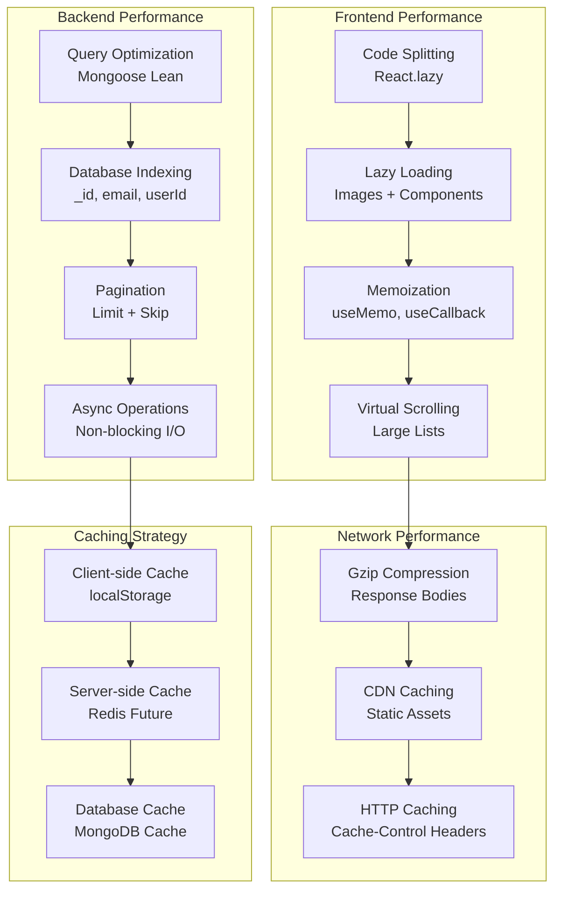

---

## Summary

This architecture documentation provides comprehensive diagrams covering:

✅ **System Architecture** - High-level multi-tier architecture with load balancing
✅ **Layered Architecture** - Seven distinct layers from presentation to external services
✅ **Component Architecture** - Frontend and backend component hierarchies
✅ **Data Architecture** - Complete ER diagram with 14 collections and data flow
✅ **Security Architecture** - Six-layer security model with authentication flow
✅ **Deployment Architecture** - Development and production environments with CI/CD
✅ **Integration Architecture** - External service integration patterns
✅ **Performance Architecture** - Optimization strategies across all layers

Each diagram uses Mermaid format for clear visualization and can be rendered in any compatible viewer.
