# LUMIQ - Software Architecture

A clear and comprehensive overview of the LUMIQ platform's software architecture, designed for roommate matching and dormitory management.

---

## Complete System Architecture

This diagram shows the complete LUMIQ platform architecture using clear layering from users to infrastructure.

```mermaid
graph TB
    subgraph Layer1["<b>LAYER 1: Users</b>"]
        Students["👥 Students<br/><i>Browse & Match</i>"]
        Admins["👨‍💼 Dorm Admins<br/><i>Manage Properties</i>"]
    end
    
    subgraph Layer2["<b>LAYER 2: Frontend - Vercel</b>"]
        UI["React Application<br/>• Dorm Browsing<br/>• Roommate Matching<br/>• Chat Interface<br/>• Booking System<br/>• Admin Dashboard"]
    end
    
    subgraph Layer3["<b>LAYER 3: Backend - Render</b>"]
        API["API Gateway<br/>• Authentication & Security<br/>• Request Validation"]
        Services["Core Services<br/>• AI Matching<br/>• Room Management<br/>• Chat System<br/>• Notifications"]
    end
    
    subgraph Layer4["<b>LAYER 4: Database - MongoDB Cloud</b>"]
        DB["Data Collections<br/>• Users & Profiles<br/>• Dorms & Rooms<br/>• Bookings<br/>• Messages<br/>• Personalities<br/>• Match Results"]
    end
    
    subgraph Layer5["<b>LAYER 5: External Services</b>"]
        AI["🤖 GROQ AI<br/><i>Roommate Matching</i>"]
        Storage["📁 File Storage<br/><i>Images & Documents</i>"]
        Email["📧 Email Service<br/><i>Notifications</i>"]
    end
    
    %% Layer Connections
    Students --> UI
    Admins --> UI
    UI -->|"HTTPS/JSON"| API
    API --> Services
    Services --> DB
    Services --> AI
    Services --> Storage
    Services --> Email
    
    %% Styling
    style Layer1 fill:#e3f2fd,stroke:#1976d2,stroke-width:3px
    style Layer2 fill:#f3e5f5,stroke:#7b1fa2,stroke-width:3px
    style Layer3 fill:#e8f5e9,stroke:#388e3c,stroke-width:3px
    style Layer4 fill:#fff3e0,stroke:#f57c00,stroke-width:3px
    style Layer5 fill:#fce4ec,stroke:#c2185b,stroke-width:3px
    
    style Students fill:#bbdefb,stroke:#1976d2,stroke-width:2px
    style Admins fill:#bbdefb,stroke:#1976d2,stroke-width:2px
    style UI fill:#e1bee7,stroke:#7b1fa2,stroke-width:2px
    style API fill:#c8e6c9,stroke:#388e3c,stroke-width:2px
    style Services fill:#c8e6c9,stroke:#388e3c,stroke-width:2px
    style DB fill:#ffe0b2,stroke:#f57c00,stroke-width:2px
    style AI fill:#f8bbd0,stroke:#c2185b,stroke-width:2px
    style Storage fill:#f8bbd0,stroke:#c2185b,stroke-width:2px
    style Email fill:#f8bbd0,stroke:#c2185b,stroke-width:2px
```

### Architecture Flow

1. **Users** interact with the web application
2. **Frontend (Vercel)** provides the user interface and handles all user interactions
3. **Backend (Render)** processes requests, enforces security, and manages business logic
4. **Database (MongoDB)** stores all application data securely
5. **External Services** provide AI matching, file storage, and email capabilities

---

## Architecture Layers

The LUMIQ platform is built with a clean separation of concerns across multiple layers:

### 1. **Presentation Layer** (Frontend - Vercel)
- **Technology**: React with TypeScript
- **Purpose**: User interface and user experience
- **Components**:
  - Student-facing pages for browsing dorms and finding roommates
  - Admin dashboard for managing properties
  - Real-time chat interface for matched roommates
  - Booking and reservation forms
- **Deployment**: Hosted on Vercel for fast global delivery

### 2. **API Gateway Layer** (Backend - Render)
- **Technology**: Express.js (Node.js)
- **Purpose**: Handle all client requests securely
- **Features**:
  - User authentication with JWT tokens
  - Role-based access control (Student, Dorm Admin, System Admin)
  - Request validation and error handling
  - CORS security for frontend communication
- **Deployment**: Hosted on Render with automatic scaling

### 3. **Business Logic Layer** (Backend - Render)
- **Core Services**:
  - **AI Matching**: Uses GROQ AI to analyze personality compatibility between potential roommates
  - **Room Management**: Handles room availability, reservations, and booking workflows
  - **Notification System**: Sends alerts for new matches, bookings, and messages
  - **Chat System**: Enables real-time messaging between matched users
  
### 4. **Data Layer** (MongoDB Cloud)
- **Technology**: MongoDB (Document Database)
- **Data Collections**:
  - Users and their profiles
  - Dormitories and rooms
  - Booking records
  - Personality profiles for matching
  - Chat conversations and messages
  - Match requests ("Knocks")
  - User notifications
  
### 5. **External Integration Layer**
- **GROQ AI API**: Powers intelligent roommate matching based on personality analysis
- **File Storage**: Stores dorm images and user documents
- **Email Service**: Sends notification emails to users

---

## How Data Flows Through the System

---

## Security Model

The platform implements multiple layers of security:

**Security Features:**
- All communication encrypted with HTTPS
- User passwords hashed with bcrypt (never stored in plain text)
- JWT tokens for stateless authentication
- Role-based access ensures users only see their own data
- Dorm admins can only manage their own properties
- Input validation prevents malicious data
- Secure database connections with authentication

---

## Deployment Architecture

**Deployment Details:**
- **Frontend (Vercel)**: 
  - Automatic deployments from Git repository
  - Global CDN for fast loading worldwide
  - Optimized production builds
  
- **Backend (Render)**: 
  - Automatic scaling based on traffic
  - Health monitoring and auto-recovery
  - Environment variable management
  - Automatic HTTPS certificates
  
- **Database (MongoDB Cloud)**: 
  - Managed MongoDB service
  - Automatic backups
  - Replica sets for data safety
  - Scalable storage

---

## Key Features Architecture

### User Roles and Capabilities

### AI-Powered Roommate Matching

The platform uses artificial intelligence to match compatible roommates:

1. **Personality Profile Creation**: Students fill out a comprehensive personality questionnaire
2. **AI Analysis**: GROQ AI analyzes compatibility based on:
   - Lifestyle preferences (sleep schedule, cleanliness, social habits)
   - Study habits and noise tolerance
   - Personal traits (MBTI personality type)
   - Living preferences (temperature, pets, smoking)
3. **Match Scoring**: System generates compatibility scores
4. **Smart Recommendations**: Users receive ranked matches with detailed compatibility breakdowns

### Real-Time Communication

The chat system enables matched users to communicate:
- One-on-one conversations between matched roommates
- Message delivery tracking (read/unread status)
- Conversation history persistence
- Secure participant-only access (RBAC enforced)

---

## Database Structure

The platform stores data across multiple collections:

---

## Technology Stack

### Frontend
- **Framework**: React 18 with TypeScript
- **Routing**: React Router v7
- **Styling**: Tailwind CSS with shadcn/ui components
- **State Management**: Context API
- **HTTP Client**: Axios with interceptors
- **Build Tool**: Vite

### Backend
- **Runtime**: Node.js
- **Framework**: Express.js
- **Database ODM**: Mongoose
- **Authentication**: JWT (JSON Web Tokens)
- **Password Hashing**: bcrypt
- **File Handling**: Multer

### Database
- **Primary Database**: MongoDB (Cloud-hosted)
- **Structure**: Document-based NoSQL
- **Features**: Indexes, validation, relationships

### External Services
- **AI**: GROQ Cloud API with Llama 3.3 70B model
- **File Storage**: Cloud storage for images and documents
- **Email**: Email service for notifications

---

## Summary

The LUMIQ platform is a modern, scalable application designed to:
- Help students find compatible roommates using AI
- Enable dormitory administrators to manage their properties
- Provide a seamless booking experience
- Facilitate communication between matched users

**Key Strengths:**
- ✅ Clean architecture with separated concerns
- ✅ Secure authentication and role-based access control
- ✅ AI-powered intelligent matching
- ✅ Scalable cloud deployment (Vercel + Render + MongoDB Cloud)
- ✅ Real-time features for modern user experience
- ✅ Comprehensive data model for all platform needs
