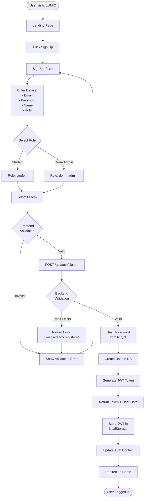
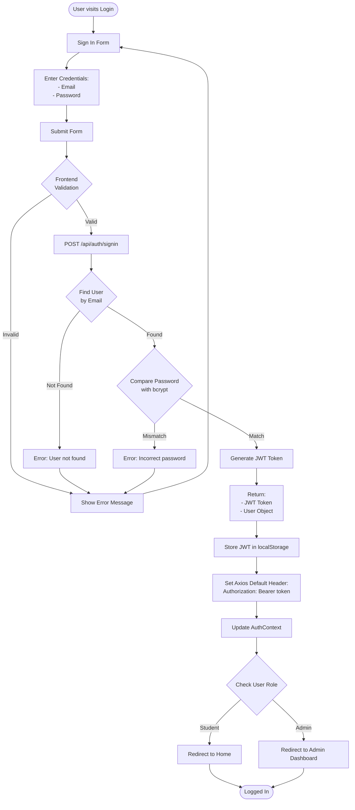
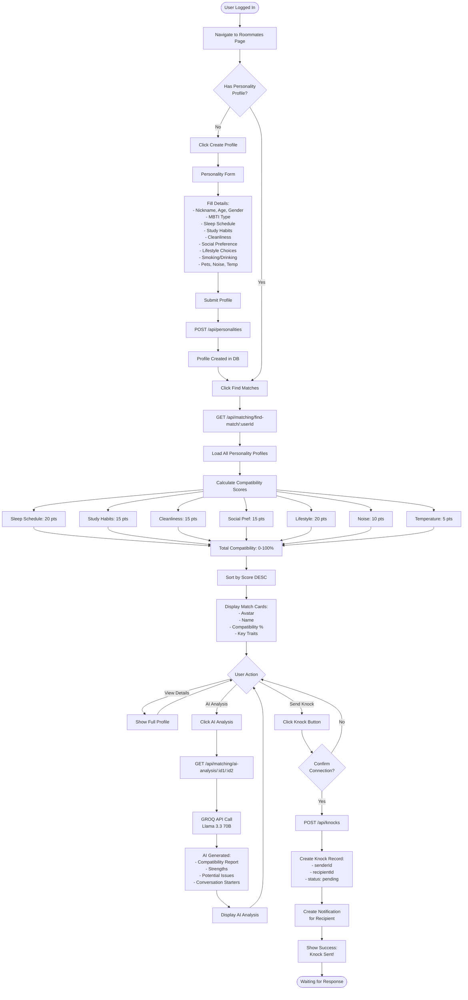
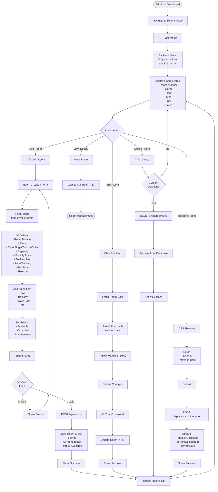

# LUMIQ - System Workflow Documentation

This document provides detailed workflow diagrams for all major user journeys and system processes in the LUMIQ platform.

---

## Table of Contents

1. [Authentication Workflows](#authentication-workflows)
2. [Student User Workflows](#student-user-workflows)
3. [Dorm Admin Workflows](#dorm-admin-workflows)
4. [System Integration Flows](#system-integration-flows)

---

## Authentication Workflows

### 1. User Registration Flow



### 2. User Login Flow



---

## Student User Workflows

### 3. Dorm Search & Booking Flow

```mermaid
flowchart TD
    Start([User on Home Page]) --> BrowseDorms[Click Browse Dorms]
    BrowseDorms --> AllDormsPage[All Dorms Page]
    
    AllDormsPage --> LoadDorms[GET /api/dorms]
    LoadDorms --> DisplayGrid[Display Dorms Grid]
    
    DisplayGrid --> UserAction{User Action}
    
    UserAction -->|Search| SearchInput[Enter Search Query]
    SearchInput --> FilterClient[Client-side Filter<br/>by name/location]
    FilterClient --> UpdateGrid[Update Display]
    UpdateGrid --> UserAction
    
    UserAction -->|Select Dorm| ViewDetails[Click Dorm Card]
    ViewDetails --> DormDetailPage[Dorm Detail Page]
    
    DormDetailPage --> FetchDetails[GET /api/dorms/:id]
    FetchDetails --> LoadRooms[GET /api/rooms?dormId=X]
    LoadRooms --> DisplayDetails[Display:<br/>- Images<br/>- Amenities<br/>- Rooms<br/>- Pricing]
    
    DisplayDetails --> SelectRoom{Select Room}
    SelectRoom -->|No rooms| ShowUnavailable[No Rooms Available]
    
    SelectRoom -->|Room Selected| BookButton[Click Book Now]
    BookButton --> CheckAuth{User<br/>Authenticated?}
    
    CheckAuth -->|No| RedirectLogin[Redirect to Login<br/>with return URL]
    RedirectLogin --> LoginComplete[After Login]
    LoginComplete --> BookingPage
    
    CheckAuth -->|Yes| BookingPage[Room Booking Page]
    BookingPage --> LoadUserData[Load User Profile Data]
    LoadUserData --> PreFillForm[Pre-fill Form:<br/>- Name<br/>- Email<br/>- Phone]
    
    PreFillForm --> UserFillsForm[User Completes:<br/>- Move-in Date<br/>- Stay Duration<br/>- Payment Method]
    
    UserFillsForm --> ReviewPricing[Review Price Breakdown:<br/>- Room Price<br/>- Insurance<br/>- Utilities Est.<br/>- Booking Fee]
    
    ReviewPricing --> SelectPayment{Payment Method}
    
    SelectPayment -->|Card| CardDetails[Enter Card Details]
    SelectPayment -->|QR| ShowQR[Display PromptPay QR]
    SelectPayment -->|Slip| UploadSlip[Upload Payment Slip]
    
    CardDetails --> ConfirmBooking
    ShowQR --> ConfirmBooking
    UploadSlip --> ConfirmBooking
    
    ConfirmBooking[Click Confirm Booking] --> SubmitBooking[POST /api/bookings]
    
    SubmitBooking --> CreateBookingDB[Create Booking Record]
    CreateBookingDB --> ReserveRoom[Call RoomService.reserveRoom]
    
    ReserveRoom --> UpdateRoom{Room<br/>Available?}
    UpdateRoom -->|No| BookingPending[Status: Pending<br/>Manual confirmation needed]
    UpdateRoom -->|Yes| BookingConfirmed[Status: Confirmed<br/>Room Reserved]
    
    BookingConfirmed --> UpdateUserDorm[Update User.dormId]
    UpdateUserDorm --> NotifyAdmin[Create Notification<br/>for Dorm Admin]
    
    NotifyAdmin --> ShowSuccess[Show Success Dialog:<br/>- Booking ID<br/>- Amount Paid]
    BookingPending --> ShowSuccess
    
    ShowSuccess --> OfferInvoice{Download Invoice?}
    OfferInvoice -->|Yes| GeneratePDF[Generate PDF Invoice]
    OfferInvoice -->|No| RedirectAccount
    
    GeneratePDF --> DownloadPDF[Download PDF]
    DownloadPDF --> RedirectAccount[Redirect to My Account]
    RedirectAccount --> End([Booking Complete])
```



### 4. Roommate Matching & Connection Flow



### 5. Knock-Knock System Flow

```mermaid
flowchart TD
    Start([Knock Received]) --> Notification[User sees Notification<br/>in Navbar]
    
    Notification --> ClickNotif[Click Notification]
    ClickNotif --> KnockKnockPage[Navigate to Knock-Knock Page]
    
    KnockKnockPage --> LoadKnocks[GET /api/knocks?userId=X]
    LoadKnocks --> DisplayTabs[Display Tabs:<br/>- Received<br/>- Sent<br/>- Accepted]
    
    DisplayTabs --> ReceivedTab[View Received Tab]
    ReceivedTab --> ShowPending[Show Pending Knocks:<br/>- Sender Profile<br/>- Compatibility %]
    
    ShowPending --> UserDecision{User Decision}
    
    UserDecision -->|Reject| ClickReject[Click Reject]
    ClickReject --> UpdateReject[Update Status: rejected]
    UpdateReject --> RemoveFromList[Remove from Pending]
    RemoveFromList --> End1([Knock Rejected])
    
    UserDecision -->|Accept| ClickAccept[Click Accept]
    ClickAccept --> AcceptKnock[PUT /api/knocks/:id/accept]
    
    AcceptKnock --> UpdateStatus[Update Status: accepted]
    UpdateStatus --> NotifySender[Create Notification:<br/>Your knock was accepted!]
    NotifySender --> MoveToAccepted[Move to Accepted Tab]
    
    MoveToAccepted --> ShowConnectionPage[Show Connection Page Button]
    ShowConnectionPage --> UserClicksConnection{Navigate to<br/>Connection?}
    
    UserClicksConnection -->|Yes| ConnectionPage[Connection Page]
    ConnectionPage --> LoadConnection[GET /api/connections/:userId]
    
    LoadConnection --> ShowProfiles[Display Both Profiles:<br/>Side-by-side Comparison]
    ShowProfiles --> FetchSuggestions[GET /api/dorms/shared-suggestions]
    
    FetchSuggestions --> CalculatePriceRange[Calculate Price Intersection:<br/>User A: min-max<br/>User B: min-max<br/>Result: overlap or average]
    
    CalculatePriceRange --> QueryDoubleRooms[Query Rooms:<br/>- Type: Double<br/>- Price <= maxPrice * 2]
    
    QueryDoubleRooms --> HasRooms{Rooms<br/>Found?}
    
    HasRooms -->|No| FallbackQuery[Fetch Cheapest<br/>20 Double Rooms]
    FallbackQuery --> GroupByDorm
    
    HasRooms -->|Yes| GroupByDorm[Group by Dorm<br/>Find Best Deal per Dorm]
    GroupByDorm --> CalculateSplit[Calculate:<br/>- Total Room Price<br/>- Per-person: price/2]
    
    CalculateSplit --> DisplayDormCards[Display Dorm Cards:<br/>- Image<br/>- Location<br/>- Double Room: ฿X<br/>- You Pay: ฿X/person]
    
    DisplayDormCards --> EnableChat[Enable Chat Widget]
    EnableChat --> ChatReady[Floating Chat Button]
    
    ChatReady --> UserAction{User Action}
    
    UserAction -->|Open Chat| OpenChatWidget[Click Chat Button]
    OpenChatWidget --> LoadConversation[GET /api/conversations]
    
    LoadConversation --> HasConvo{Conversation<br/>Exists?}
    
    HasConvo -->|No| CreateConvo[POST /api/conversations<br/>participants: [user1, user2]]
    HasConvo -->|Yes| LoadMessages[GET /api/messages?conversationId=X]
    CreateConvo --> LoadMessages
    
    LoadMessages --> DisplayChat[Show Chat Widget:<br/>- Messages History<br/>- Message Input]
    
    DisplayChat --> TypeMessage[User Types Message]
    TypeMessage --> SendMessage[Press Enter or Click Send]
    SendMessage --> PostMessage[POST /api/messages]
    
    PostMessage --> SaveMessage[Save to DB:<br/>- conversationId<br/>- senderId<br/>- text<br/>- timestamp]
    SaveMessage --> NotifyRecipient2[Create Chat Notification]
    NotifyRecipient2 --> UpdateUI[Update Chat UI<br/>Show Sent Message]
    
    UpdateUI --> AutoRefresh[Auto-refresh every 30s<br/>to fetch new messages]
    AutoRefresh --> ChatActive([Chat Active])
    
    UserAction -->|View Dorm| ClickDormCard[Click Suggested Dorm]
    ClickDormCard --> NavigateToDorm[Navigate to Dorm Detail]
    NavigateToDorm --> End2([Continue Booking Flow])
    
    UserClicksConnection -->|No| End3([Stay on Knock Page])
```

---

## Dorm Admin Workflows

### 6. Dorm Creation Flow

```mermaid
flowchart TD
    Start([Admin Logged In]) --> Dashboard[Admin Dashboard]
    Dashboard --> MyDorms[Navigate to My Dorms]
    
    MyDorms --> LoadDorms[GET /api/dorms/my]
    LoadDorms --> DisplayDorms[Display Admin's Dorms]
    
    DisplayDorms --> ClickCreate[Click Create Dorm]
    ClickCreate --> DormForm[Dorm Creation Form]
    
    DormForm --> FillBasicInfo[Fill Basic Info:<br/>- Dorm Name<br/>- Description]
    
    FillBasicInfo --> FillAddress[Fill Address:<br/>- Address Line 1<br/>- Sub-district<br/>- District<br/>- Province<br/>- Zip Code<br/>- Country]
    
    FillAddress --> FillCoordinates[Fill Coordinates:<br/>- Latitude<br/>- Longitude]
    
    FillCoordinates --> FillPricing[Fill Pricing:<br/>- Base Room Price<br/>- Insurance Policy<br/>- Contract Duration]
    
    FillPricing --> FillUtilities[Fill Utility Fees:<br/>Water:<br/>- Amount<br/>- Billing Type per-month/per-unit<br/>Electricity:<br/>- Amount<br/>- Billing Type]
    
    FillUtilities --> FillContact[Fill Contact Info:<br/>- Email<br/>- Phone<br/>- LINE ID<br/>- Facebook]
    
    FillContact --> AddAmenities[Add Amenities:<br/>- WiFi<br/>- Parking<br/>- Laundry<br/>- etc.]
    
    AddAmenities --> UploadImages[Upload Images:<br/>Multiple image files]
    
    UploadImages --> ReviewForm{Review<br/>All Fields}
    
    ReviewForm -->|Incomplete| ShowValidation[Show Validation Errors]
    ShowValidation --> DormForm
    
    ReviewForm -->|Complete| SubmitForm[Submit Form]
    SubmitForm --> GetNextId[Get Next Dorm ID<br/>from Counter Service]
    
    GetNextId --> CreateDorm[POST /api/dorms<br/>with multipart/form-data]
    
    CreateDorm --> SaveImages[Save Images to /uploads]
    SaveImages --> CreateDormDB[Create Dorm in DB:<br/>- admin_id = current user<br/>- isActive = true]
    
    CreateDormDB --> ReturnDorm[Return Created Dorm]
    ReturnDorm --> ShowSuccess[Show Success Message]
    ShowSuccess --> RefreshList[Refresh Dorms List]
    RefreshList --> End([Dorm Created])
```



### 7. Room Management Flow



### 8. Booking Management Flow (with RBAC)

```mermaid
flowchart TD
    Start([Admin in Dashboard]) --> BookingsPage[Navigate to Bookings]
    
    BookingsPage --> LoadBookings[GET /api/bookings]
    LoadBookings --> CheckRole{User Role}
    
    CheckRole -->|System Admin| AllBookings[Fetch ALL Bookings]
    CheckRole -->|Dorm Admin| RBACFilter[RBAC Filtering]
    
    RBACFilter --> FindOwnDorms[Query Dorm Model:<br/>Find dorms where<br/>admin_id = currentUserId]
    FindOwnDorms --> ExtractDormIds[Extract dormIds array]
    ExtractDormIds --> FilterBookings[Query Bookings:<br/>dormId IN dormIds]
    
    FilterBookings --> OwnBookings[Return Only<br/>Own Dorm Bookings]
    OwnBookings --> DisplayTable
    AllBookings --> DisplayTable
    
    DisplayTable[Display Bookings Table:<br/>- Guest Name<br/>- Room Number<br/>- Move-in Date<br/>- Amount<br/>- Status Badge<br/>- Actions]
    
    DisplayTable --> AdminAction{Admin Action}
    
    AdminAction -->|Refresh| ClickRefresh[Click Refresh Button]
    ClickRefresh --> LoadBookings
    
    AdminAction -->|View Details| ClickDetails[Click Actions Icon]
    ClickDetails --> FetchBooking[GET /api/bookings/:id]
    
    FetchBooking --> VerifyAccess{Admin Owns<br/>This Booking's Dorm?}
    
    VerifyAccess -->|No| AccessDenied[Error 403:<br/>Access Denied]
    AccessDenied --> DisplayTable
    
    VerifyAccess -->|Yes| ShowModal[Display Booking Modal:<br/>- Booking ID<br/>- User Details<br/>- Room Details<br/>- Move-in Date<br/>- Booking Fee<br/>- Total Amount<br/>- Status<br/>- Created Date]
    
    ShowModal --> StatusDropdown[Status Dropdown:<br/>- Pending<br/>- Confirmed<br/>- Cancelled]
    
    StatusDropdown --> AdminChanges{Admin Changes<br/>Status?}
    
    AdminChanges -->|No| CloseModal[Click Close]
    CloseModal --> DisplayTable
    
    AdminChanges -->|Yes| SelectNewStatus[Select New Status]
    SelectNewStatus --> ClickSave[Click Save]
    
    ClickSave --> UpdateBooking[PUT /api/bookings/:id]
    UpdateBooking --> VerifyOwnershipAgain{Verify Dorm<br/>Ownership}
    
    VerifyOwnershipAgain -->|No| UpdateDenied[Error 403:<br/>Cannot modify]
    UpdateDenied --> ShowModal
    
    VerifyOwnershipAgain -->|Yes| UpdateStatus[Update booking.status<br/>in Database]
    UpdateStatus --> SaveChanges[Save to DB]
    SaveChanges --> NotifyUser[Create Notification<br/>for Student]
    
    NotifyUser --> ShowUpdateSuccess[Show Success Message]
    ShowUpdateSuccess --> CloseModalAuto[Auto-close Modal]
    CloseModalAuto --> RefreshTable[Refresh Bookings]
    RefreshTable --> End([Booking Updated])
```



---

## System Integration Flows

### 9. Notification System Flow

```mermaid
flowchart TD
    Start([System Event Occurs]) --> EventType{Event Type}
    
    EventType -->|New Knock| KnockEvent[Knock Created]
    EventType -->|Knock Accepted| AcceptEvent[Knock Accepted]
    EventType -->|New Booking| BookingEvent[Booking Created]
    EventType -->|Chat Message| MessageEvent[Message Sent]
    EventType -->|System Alert| SystemEvent[System Notification]
    
    KnockEvent --> CreateKnockNotif[Create Notification:<br/>type: 'knock'<br/>title: 'New Knock!'<br/>message: 'X wants to connect'<br/>recipientId: knock.recipientId<br/>data: senderId, knockId]
    
    AcceptEvent --> CreateAcceptNotif[Create Notification:<br/>type: 'knock_accepted'<br/>title: 'Knock Accepted'<br/>message: 'X accepted your knock'<br/>recipientId: knock.senderId<br/>data: recipientId, knockId]
    
    BookingEvent --> GetDormAdmin[Get Dorm admin_id]
    GetDormAdmin --> CreateBookingNotif[Create Notification:<br/>type: 'booking'<br/>title: 'New Booking'<br/>message: 'X booked room Y'<br/>recipientId: admin_id<br/>data: bookingId, userId, roomId]
    
    MessageEvent --> CheckIfActive{Recipient has<br/>active chat session?}
    CheckIfActive -->|Yes| SkipNotif[Skip Notification<br/>User can see message]
    CheckIfActive -->|No| CreateOrUpdateNotif[Find or Create Message Notification]
    
    CreateOrUpdateNotif --> ExistingMsgNotif{Existing notif<br/>from sender?}
    ExistingMsgNotif -->|Yes| UpdateNotif[Update Notification:<br/>message = new message text<br/>timestamp = now]
    ExistingMsgNotif -->|No| CreateMsgNotif[Create New Notification:<br/>type: 'message'<br/>title: 'New Message'<br/>message: message text<br/>recipientId<br/>data: senderId, conversationId]
    
    UpdateNotif --> SaveNotif
    CreateMsgNotif --> SaveNotif
    
    SystemEvent --> CreateSystemNotif[Create Notification:<br/>type: 'system'<br/>custom title/message<br/>recipientId]
    
    CreateKnockNotif --> SaveNotif[POST /api/notifications Internal]
    CreateAcceptNotif --> SaveNotif
    CreateBookingNotif --> SaveNotif
    CreateSystemNotif --> SaveNotif
    
    SaveNotif --> InsertDB[Insert into notifications collection:<br/>- recipientId<br/>- type<br/>- title<br/>- message<br/>- read: false<br/>- data: {}<br/>- createdAt]
    
    InsertDB --> NotificationStored[Notification Stored]
    NotificationStored --> WaitForPoll[Wait for Client Poll]
    
    WaitForPoll --> ClientPolls[Client Polls:<br/>GET /api/notifications<br/>Every 30 seconds]
    
    ClientPolls --> FetchUnread[Query DB:<br/>recipientId = userId<br/>read = false<br/>Sort by createdAt DESC]
    
    FetchUnread --> CountUnread[Count unread]
    CountUnread --> ReturnNotifs[Return:<br/>- notifications array<br/>- unread count]
    
    ReturnNotifs --> ClientReceives[Client Receives Data]
    ClientReceives --> UpdateBadge[Update Navbar Badge:<br/>Show unread count]
    UpdateBadge --> DisplayPanel[Update Notification Panel:<br/>List with icons/titles]
    
    DisplayPanel --> UserAction{User Action}
    
    UserAction -->|Click Notification| MarkAsRead[PUT /api/notifications/:id/read]
    MarkAsRead --> UpdateReadFlag[Update read: true in DB]
    UpdateReadFlag --> Navigate[Navigate to Related Page:<br/>- Knock page<br/>- Booking page<br/>- Chat page]
    Navigate --> DecrementBadge[Update Badge Count]
    
    UserAction -->|Delete| DeleteNotif[DELETE /api/notifications/:id]
    DeleteNotif --> RemoveFromDB[Remove from DB]
    RemoveFromDB --> RefreshPanel[Refresh Panel]
    
    UserAction -->|Ignore| ContinuePolling[Continue 30s Polling]
    ContinuePolling --> ClientPolls
    
    Navigate --> End([User Navigated])
    RefreshPanel --> End
    DecrementBadge --> End
    SkipNotif --> End
```

### 10. AI Roommate Analysis Flow

```mermaid
flowchart TD
    Start([User Requests AI Analysis]) --> ClickAI[Click AI Analysis Button<br/>on Match Card]
    
    ClickAI --> ShowLoading[Show Loading State]
    ShowLoading --> SendRequest[GET /api/matching/ai-analysis/:userId1/:userId2]
    
    SendRequest --> FetchProfiles[Fetch Both Personality Profiles<br/>from Database]
    FetchProfiles --> CheckCache{Check<br/>AiMatchResult cache}
    
    CheckCache -->|Found Recent| ReturnCached[Return Cached Analysis<br/>if less than 24h old]
    ReturnCached --> DisplayResult
    
    CheckCache -->|Not Found/Expired| BuildPrompt[Build AI Prompt]
    BuildPrompt --> FormatProfiles[Format User Profiles:<br/>User 1: name, MBTI, traits<br/>User 2: name, MBTI, traits]
    
    FormatProfiles --> CreatePrompt[Create Detailed Prompt:<br/>'Analyze compatibility between:<br/>User 1: [profile data]<br/>User 2: [profile data]<br/><br/>Provide:<br/>1. Overall compatibility<br/>2. Strengths<br/>3. Potential conflicts<br/>4. Advice<br/>5. Conversation starters']
    
    CreatePrompt --> CallGroqAPI[Call GROQ API:<br/>Model: llama-3.3-70b-versatile<br/>Temperature: 0.7<br/>Max Tokens: 1024]
    
    CallGroqAPI --> GroqProcessing[GROQ AI Processing:<br/>- Analyze personalities<br/>- Compare traits<br/>- Generate insights<br/>- Create recommendations]
    
    GroqProcessing --> ReceiveResponse[Receive AI Response]
    ReceiveResponse --> ParseResponse[Parse JSON/Text Response]
    
    ParseResponse --> ExtractData[Extract:<br/>- Compatibility Score<br/>- Strengths List<br/>- Concerns List<br/>- Advice Text<br/>- Conversation Starters]
    
    ExtractData --> SaveCache[Save to AiMatchResult:<br/>- userId1<br/>- userId2<br/>- analysis result<br/>- timestamp<br/>- expiresAt: +24h]
    
    SaveCache --> DisplayResult[Return AI Analysis]
    
    DisplayResult --> ShowModal[Display Modal:<br/>- Compatibility % with visual<br/>- Strengths section<br/>- Potential Issues section<br/>- Advice paragraph<br/>- Conversation Starters list]
    
    ShowModal --> UserReview[User Reviews Analysis]
    UserReview --> UserDecision{User Decision}
    
    UserDecision -->|Close| CloseModal[Close Modal]
    CloseModal --> End1([Analysis Complete])
    
    UserDecision -->|Send Knock| InitiateKnock[Navigate to Knock Action]
    InitiateKnock --> End2([Proceed to Knock Flow])
```

### 11. Price Calculation & Invoice Generation Flow

```mermaid
flowchart TD
    Start([User on Booking Page]) --> LoadData[Load Dorm \u0026 Room Data]
    
    LoadData --> ExtractPricing[Extract Pricing Data:<br/>- room.price_per_month<br/>- dorm.insurance_policy<br/>- room.booking_fees<br/>- dorm.Water_fee<br/>- dorm.Electricity_fee<br/>- dorm.waterBillingType<br/>- dorm.electricityBillingType]
    
    ExtractPricing --> CalcUtilities[Calculate Utility Estimates]
    
    CalcUtilities --> CheckWaterType{Water Billing<br/>Type?}
    CheckWaterType -->|per-unit| WaterEstimate200[Water Estimate: ฿200<br/>Fixed estimate for usage]
    CheckWaterType -->|per-month| WaterActual[Water Fee: dorm.Water_fee<br/>Exact monthly cost]
    
    WaterEstimate200 --> CheckElectricType
    WaterActual --> CheckElectricType
    
    CheckElectricType{Electricity<br/>Billing Type?}
    CheckElectricType -->|per-unit| ElectricEstimate500[Electricity Estimate: ฿500<br/>Fixed estimate for usage]
    CheckElectricType -->|per-month| ElectricActual[Electricity Fee: dorm.Electricity_fee<br/>Exact monthly cost]
    
    ElectricEstimate500 --> BuildPriceObject
    ElectricActual --> BuildPriceObject
    
    BuildPriceObject[Build prices object:<br/>- roomPerMonth<br/>- insurance<br/>- bookingFee<br/>- waterRate<br/>- electricityRate<br/>- waterFees estimated<br/>- electricityFees estimated<br/>- waterLabel with type<br/>- electricityLabel with type]
    
    BuildPriceObject --> CalcFirstMonth[Calculate First Month Total:<br/>= roomPerMonth<br/>- bookingFee already paid<br/>+ insurance one-time<br/>+ waterFees<br/>+ electricityFees]
    
    CalcFirstMonth --> CalcFollowing[Calculate Following Months:<br/>= roomPerMonth<br/>+ waterFees<br/>+ electricityFees]
    
    CalcFollowing --> DisplayBreakdown[Display Price Breakdown:<br/><br/>Room Price: ฿X/month<br/>Insurance: ฿Y one-time<br/>Booking Fee: ฿Z<br/>Water Fees ฿A / unit: ~฿200<br/>Electricity ฿B / unit: ~฿500<br/><br/>First Month Total: ~฿X,XXX<br/>Following Months: ~฿X,XXX]
    
    DisplayBreakdown --> UserConfirms{User Confirms<br/>Booking?}
    
    UserConfirms -->|No| EditBooking[User edits details]
    EditBooking --> CalcUtilities
    
    UserConfirms -->|Yes| SubmitBooking[Submit Booking Form]
    SubmitBooking --> CreateBookingRecord[Create Booking in DB]
    
    CreateBookingRecord --> PrepareInvoiceData[Prepare Invoice Data:<br/>- bookingId<br/>- invoiceDate: now<br/>- customerName<br/>- customerEmail<br/>- customerPhone<br/>- dormName<br/>- dormAddress<br/>- dormPhone/Email/LINE/FB<br/>- roomNumber<br/>- roomType<br/>- floor<br/>- moveInDate<br/>- stayDuration<br/>- All pricing details]
    
    PrepareInvoiceData --> GenerateHTML[Generate Invoice HTML:<br/>- Professional template<br/>- Company header<br/>- Invoice # and Date<br/>- Customer info section<br/>- Property details<br/>- Itemized price table<br/>- Subtotals<br/>- Grand total<br/>- Footer with terms]
    
    GenerateHTML --> ShowSuccessDialog[Show Success Dialog:<br/>- Booking confirmed<br/>- Booking ID<br/>- Amount paid]
    
    ShowSuccessDialog --> OfferDownload{User Clicks<br/>Download Invoice?}
    
    OfferDownload -->|No| CloseAndRedirect[Redirect to Account Page]
    
    OfferDownload -->|Yes| OpenPreviewModal[Open Invoice Preview Modal:<br/>- Full-screen overlay<br/>- Iframe with HTML invoice<br/>- A4 size 210mm x 297mm]
    
    OpenPreviewModal --> UserAction{User Action}
    
    UserAction -->|Download PDF| TriggerDownload[Trigger Browser Print:<br/>window.print<br/>or PDF generation library]
    TriggerDownload --> SavePDF[User saves as PDF<br/>filename: invoice-bookingId.pdf]
    SavePDF --> DownloadComplete[PDF Downloaded]
    
    UserAction -->|Close Preview| ClosePreview[Close Modal]
    DownloadComplete --> ClosePreview
    
    ClosePreview --> RedirectAccount[Redirect to My Account]
    CloseAndRedirect --> RedirectAccount
    
    RedirectAccount --> End([Booking \u0026 Invoice Complete])
```



---

## Summary

This workflow documentation covers:

✅ **11 Detailed Workflow Diagrams** covering all major system processes
✅ **Mermaid Diagram Format** for clear visualization
✅ **Decision Points** showing all conditional logic paths
✅ **API Endpoints** referenced at each integration point
✅ **Database Operations** showing data persistence steps
✅ **Error Handling** paths for validation and failures
✅ **Security Checks** including RBAC verification steps
✅ **User Journey Maps** from start to completion

Each workflow can be rendered as a visual diagram using any Mermaid-compatible viewer or documentation tool.
