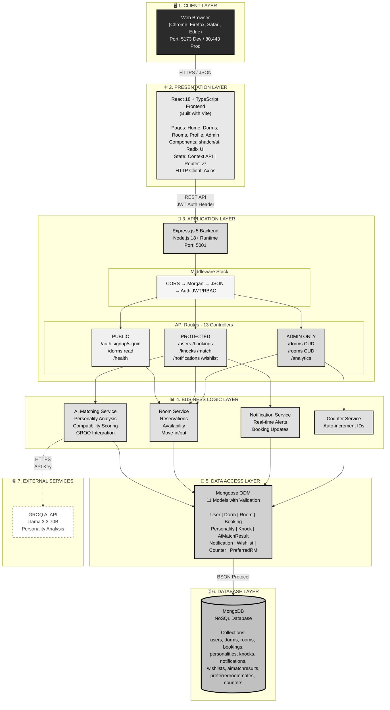

```mermaid
graph TB
    %% ============================================================================
    %% LUMIQ PLATFORM - DETAILED ARCHITECTURE DIAGRAM
    %% 7-Layer Architecture matching README.md
    %% ============================================================================

    %% 1. CLIENT LAYER
    subgraph ClientLayer ["🖥️ 1. CLIENT LAYER"]
        Browser["Web Browser<br/>(Chrome, Firefox, Safari, Edge)<br/>Port: 5173 Dev / 80,443 Prod"]:::client
    end

    %% 2. PRESENTATION LAYER
    subgraph PresentationLayer ["⚛️ 2. PRESENTATION LAYER"]
        direction TB
        WebApp["React 18 + TypeScript Frontend<br/>(Built with Vite)<br/><br/>Pages: Home, Dorms, Rooms, Profile, Admin<br/>Components: shadcn/ui, Radix UI<br/>State: Context API | Router: v7<br/>HTTP Client: Axios"]:::frontend
    end

    %% 3. APPLICATION LAYER
    subgraph AppLayer ["🔧 3. APPLICATION LAYER"]
        direction TB
        Backend["Express.js 5 Backend<br/>Node.js 18+ Runtime<br/>Port: 5001"]:::backend
        
        subgraph MiddlewareStack ["Middleware Stack"]
            MW["CORS → Morgan → JSON → Auth JWT/RBAC"]:::middleware
        end
        
        subgraph APIRoutes ["API Routes - 13 Controllers"]
            RoutesPublic["PUBLIC<br/>/auth signup/signin<br/>/dorms read<br/>/health"]:::routePublic
            RoutesProtected["PROTECTED<br/>/users /bookings<br/>/knocks /match<br/>/notifications /wishlist"]:::routeProtected
            RoutesAdmin["ADMIN ONLY<br/>/dorms CUD<br/>/rooms CUD<br/>/analytics"]:::routeAdmin
        end
    end

    %% 4. BUSINESS LOGIC LAYER
    subgraph BusinessLayer ["📊 4. BUSINESS LOGIC LAYER"]
        direction LR
        ServiceAI["AI Matching Service<br/>Personality Analysis<br/>Compatibility Scoring<br/>GROQ Integration"]:::service
        ServiceRoom["Room Service<br/>Reservations<br/>Availability<br/>Move-in/out"]:::service
        ServiceNotify["Notification Service<br/>Real-time Alerts<br/>Booking Updates"]:::service
        ServiceCounter["Counter Service<br/>Auto-increment IDs"]:::service
    end

    %% 5. DATA ACCESS LAYER
    subgraph DataAccessLayer ["💾 5. DATA ACCESS LAYER"]
        Mongoose["Mongoose ODM<br/>11 Models with Validation<br/><br/>User | Dorm | Room | Booking<br/>Personality | Knock | AiMatchResult<br/>Notification | Wishlist | Counter | PreferredRM"]:::odm
    end

    %% 6. DATABASE LAYER
    subgraph DatabaseLayer ["🗄️ 6. DATABASE LAYER"]
        MongoDB[("MongoDB<br/>NoSQL Database<br/><br/>Collections:<br/>users, dorms, rooms, bookings,<br/>personalities, knocks, notifications,<br/>wishlists, aimatchresults,<br/>preferredroommates, counters")]:::database
    end

    %% 7. EXTERNAL SERVICES
    subgraph ExternalLayer ["🌐 7. EXTERNAL SERVICES"]
        GroqAPI["GROQ AI API<br/>Llama 3.3 70B<br/>Personality Analysis"]:::external
    end

    %% ============================================================================
    %% DATA FLOW CONNECTIONS
    %% ============================================================================

    Browser -->|HTTPS / JSON| WebApp
    WebApp -->|REST API<br/>JWT Auth Header| Backend
    Backend --> MW
    MW --> RoutesPublic
    MW --> RoutesProtected
    MW --> RoutesAdmin
    
    RoutesPublic --> ServiceRoom
    RoutesProtected --> ServiceAI
    RoutesProtected --> ServiceRoom
    RoutesProtected --> ServiceNotify
    RoutesAdmin --> ServiceRoom
    RoutesAdmin --> ServiceCounter
    
    ServiceAI -.->|HTTPS<br/>API Key| GroqAPI
    
    ServiceAI --> Mongoose
    ServiceRoom --> Mongoose
    ServiceNotify --> Mongoose
    ServiceCounter --> Mongoose
    
    Mongoose -->|BSON Protocol| MongoDB

    %% ============================================================================
    %% STYLING - Professional Monochrome
    %% ============================================================================
    
    classDef client fill:#2b2b2b,stroke:#000,stroke-width:2px,color:#fff
    classDef frontend fill:#e8e8e8,stroke:#000,stroke-width:2px,color:#000
    classDef backend fill:#d9d9d9,stroke:#000,stroke-width:2px,color:#000
    classDef middleware fill:#f5f5f5,stroke:#000,stroke-width:1px,color:#000
    classDef routePublic fill:#f0f0f0,stroke:#000,stroke-width:1px,color:#000
    classDef routeProtected fill:#e8e8e8,stroke:#000,stroke-width:1px,color:#000
    classDef routeAdmin fill:#d9d9d9,stroke:#000,stroke-width:1px,color:#000
    classDef service fill:#e0e0e0,stroke:#000,stroke-width:2px,color:#000
    classDef odm fill:#d0d0d0,stroke:#000,stroke-width:2px,color:#000
    classDef database fill:#c0c0c0,stroke:#000,stroke-width:3px,color:#000
    classDef external fill:#fff,stroke:#666,stroke-width:2px,stroke-dasharray:5 5,color:#333
```
